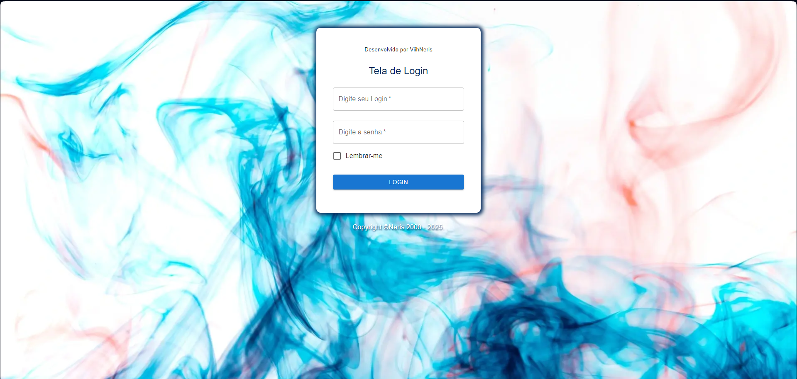
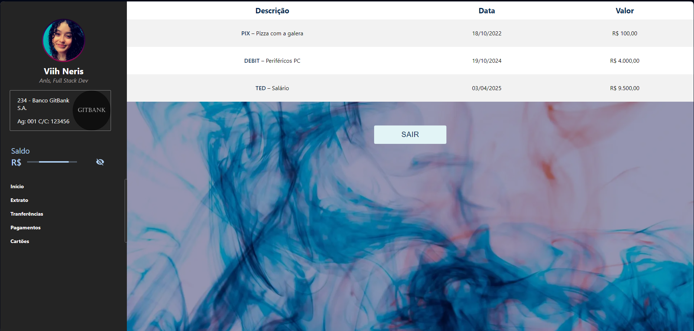

# Projeto GitBank 🔵⚫

Bem-vindo ao GitBank!

Um mini projeto de sistema bancário desenvolvido para demonstrar habilidades em React e Next.js.

Este projeto apresenta uma interface de gerenciamento de dados bancários, incluindo telas de login, gerenciamento de dados e perfil do usuário. Acompanhe abaixo as telas desenvolvidas!

### Tela de Login 👤

A Tela de Login solicita o e-mail e a senha do usuário com requisitos mínimos. Se a ação for bem sucedida, o usuário recebe a informação que está logado e lhe será permitido clicar na URL que o direcionará para a Home.

### Tela de Gerenciamento de Dados 🎲

Abaixo está a tela de gerenciamento de dados, com uma SideBar contendo área para Perfil e Menu. Além disso, há uma tabela de informações listando detalhadamente os gastos do usuário, com data e descrição dos mesmos.

## Teste você mesmo 🙆🏻‍♀️💻

Acesse o link a seguir para testar o projeto! https://gitbank.vercel.app/login 👈🏻💜👩🏻‍💻
  

## Conhecimentos Aplicados 📚

- Components;
- Styles;
- MUI;
- Router;
- Functions;
- Props;
- Types;
- Library;
- SVG;
- Settings React/Next.
